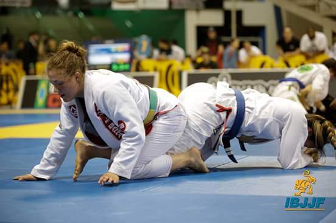

# BJJStar 
Visit the [website](https://bjj-stars.onrender.com).  Beware, you'll have to create an account. 

## What is BJJ Stars?
Bjj Stars is designed for the Brazilian Jiu-Jitsu Practitioner. Whether you are a just begininng your Jiu-Jitsu journey, or have been studying for years, BJJ Stars is here to help.

At it's core, BJJ Stars records any new skills you obtain. You can then reference the skills at a later date to refresh your memory.

You can register as a Student, Instructor or School.

## Inspiration

I have practiced Brazilian Jiu-Jitsu for over ten years. And as a practitioner I recognized that there was not a standard way of tracking my skills, or for my instructors to track my skills. 

Once I became a programmer, I was able to fufill a genuine need within a niche community.

## Technologies
- HTML
- CSS
- Express
- Node.js
- Embdedded Java Script
- PostgresSQL
- Bootstrap

## Challenges
- Connecting **six** databses with their congruent foreign keys.
- Learning bcrypt
- Learning Bootstrap
- Learning how to use cookies

## Current Goals

- [x] Update database from local to cloud based
- [x] Host the site on Render
- [ ] Fine tune the Instructor's side
- [ ] Fine tune the School's side
- [ ] Debug a glitch in the student's skills table
